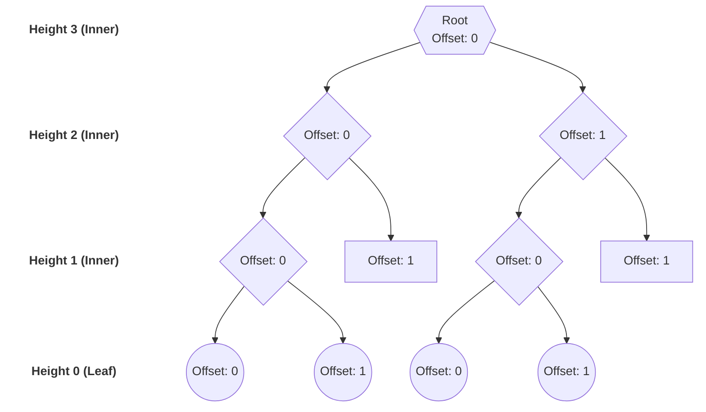

# Predicates

Predicates are functions that return a boolean value. They are used to filter nodes, simplifying code and making it much more readable. Because they are efficient, they can be easily combined to create complex structural queries.

> **Mental Model:** Always think of predicates from the *current node's* perspective (e.g., *"Is this node a descendant of X?"*, *"Does this node have children?"*).

---

## Tree Concepts

### Structure

The following predicates evaluate the *structure* of a node.

| Predicate | Arguments    | Description                                                 |
| --------- | ------------ | ----------------------------------------------------------- |
| `Inner`   |              | Is an inner node (i.e., can have children, `height > 0`).   |
| `Leaf`    |              | Is a leaf node (i.e., cannot have children, `height == 0`). |
| `Height`  | `min`, `max` | Height is in `[min..max]`.                                  |
| `Offset`  | `min`, `max` | Offset is in `[min..max]`.                                  |

Below you can find a binary tree diagram to illustrate when the different predicates return true. 



### State

The following predicates evaluate the *current state* of a node.

| Predicate     | Description             |
| ------------- | ----------------------- |
| `HasChildren` | Has children.           |
| `Childless`   | Is childless.           |
| `Exists`      | Exists.                 |
| `Modified`    | Is in a modified state. |

### Relationships

These predicates evaluate a node based on its position relative to a target node (`T`).

| Predicate      | Arguments | Description                                       |
| -------------- | --------- | ------------------------------------------------- |
| `AncestorOf`   | `query`   | Is an ancestor of the given `query` node.         |
| `SiblingOf`    | `query`   | Shares the same parent as the given `query` node. |
| `DescendantOf` | `query`   | Is a descendant of the given `query` node.        |

---

## Spatial & Coordinates

### Spatial

These predicates evaluate the physical intersection between a node and a given geometry.

<div class="middle-align-table">

| Predicate | Diagram | Arguments | Description |
| --- | :---: | :---: | --- |
| `Contains` | <svg width="80" height="50" viewBox="0 0 80 50" xmlns="http://www.w3.org/2000/svg"><circle cx="40" cy="25" r="22" fill="#3b82f6" fill-opacity="0.2" stroke="#3b82f6" stroke-width="2"/><circle cx="40" cy="25" r="10" fill="#ef4444" fill-opacity="0.2" stroke="#ef4444" stroke-width="2"/><text x="40" y="28" font-size="10" text-anchor="middle" fill="currentColor">G</text><text x="40" y="12" font-size="10" text-anchor="middle" fill="#3b82f6">N</text></svg> | `geometry` | `node` contains the `geometry`. |
| `Disjoint` | <svg width="80" height="50" viewBox="0 0 80 50" xmlns="http://www.w3.org/2000/svg"><circle cx="22" cy="25" r="15" fill="#3b82f6" fill-opacity="0.2" stroke="#3b82f6" stroke-width="2"/><circle cx="58" cy="25" r="15" fill="#ef4444" fill-opacity="0.2" stroke="#ef4444" stroke-width="2"/><text x="22" y="28" font-size="10" text-anchor="middle" fill="#3b82f6">N</text><text x="58" y="28" font-size="10" text-anchor="middle" fill="#ef4444">G</text></svg> | `geometry` | `node` is disjoint from the `geometry`. |
| `Intersects` | <svg width="80" height="50" viewBox="0 0 80 50" xmlns="http://www.w3.org/2000/svg"><circle cx="30" cy="25" r="18" fill="#3b82f6" fill-opacity="0.2" stroke="#3b82f6" stroke-width="2"/><circle cx="50" cy="25" r="18" fill="#ef4444" fill-opacity="0.2" stroke="#ef4444" stroke-width="2"/><text x="23" y="28" font-size="10" text-anchor="middle" fill="#3b82f6">N</text><text x="57" y="28" font-size="10" text-anchor="middle" fill="#ef4444">G</text></svg> | `geometry` | `node` intersects with the `geometry`. |
| `Inside` | <svg width="80" height="50" viewBox="0 0 80 50" xmlns="http://www.w3.org/2000/svg"><circle cx="40" cy="25" r="22" fill="#ef4444" fill-opacity="0.2" stroke="#ef4444" stroke-width="2"/><circle cx="40" cy="25" r="10" fill="#3b82f6" fill-opacity="0.2" stroke="#3b82f6" stroke-width="2"/><text x="40" y="28" font-size="10" text-anchor="middle" fill="currentColor">N</text><text x="40" y="12" font-size="10" text-anchor="middle" fill="#ef4444">G</text></svg> | `geometry` | `node` is inside the `geometry`. |

</div>

### Coordinates

| Predicate | Arguments    | Description                                              |
| --------- | ------------ | -------------------------------------------------------- |
| `X`       | `min`, `max` | Intersects along the x-axis with the range `[min, max]`. |
| `Y`       | `min`, `max` | Intersects along the y-axis with the range `[min, max]`. |
| `Z`       | `min`, `max` | Intersects along the z-axis with the range `[min, max]`. |
| `W`       | `min`, `max` | Intersects along the w-axis with the range `[min, max]`. |

---

## Combining Predicates

### Logical
The following predicates are used to combine, negate, or compare other predicates. 

| Predicate | Arguments | Description |
| --- | --- | --- |
| `And` | $P_1, \dots, P_n$ | True if all predicates are true ($P_1 \land \dots \land P_n$). |
| `Or` | $P_1, \dots, P_n$ | True if at least one predicate is true ($P_1 \lor \dots \lor P_n$). |
| `IfThen` | $P, Q$ | True if $P$ is false or $Q$ is true ($P \rightarrow Q$). |
| `Iff` | $P, Q$ | True if both arguments are either true or false ($P \leftrightarrow Q$). |
| `Xor` | $P, Q$ | True if exactly one argument is true ($P \oplus Q$). |

<div class="truth-table">

| P     | Q     | And<br/>$P \land Q$ | Or<br/>$P \lor Q$ | IfThen<br/>$P \rightarrow Q$ | Iff<br/>$P \leftrightarrow Q$ | Xor<br/>$P \oplus Q$ |
| :---: | :---: | :---: | :---: | :---: | :---: | :---: |
| **T** | **T** | **T** | **T** | **T** | **T** | F     |
| **T** | F     | F     | **T** | F     | F     | **T** |
| F     | **T** | F     | **T** | **T** | F     | **T** |
| F     | F     | F     | F     | **T** | **T** | F     |

</div>

#### C++ Operator Overloads
In C++, you can use standard operators to make complex queries much more readable:

| C++ Operator | Predicate | Equivalent Logic |
| :---: | --- | --- |
| `&&` | `And` | |
| `\|\|` | `Or` | |
| `!` | Negate | |
| `>>` | `IfThen` | |
| `^` | `Xor` | |
| *(None)* | `Iff` | `!(P ^ Q)` |

**Example: Combining Predicates**
Using the operators, this verbose functional code:
```cpp
auto pred = Or(And(a, Xor(b, c), d), e, Iff(f, IfThen(g, h)))

```

Can be written cleanly as:

```cpp
auto pred = (a && (b ^ c) && d) || e || !(f ^ (g >> h));

```

**Example: Negating Predicates**
For predicates that check for ranges, it can be more efficient to negate the predicate instead of splitting it into two predicates. Below, the first predicate will be two separate checks per node, while the second predicate will be a single check per node.

```cpp
// Instead of this:
auto pred = 3 > depth || depth > 5;

// You can write this:
auto pred = !(3 < depth < 5);
```

> **⚠️ Note on C++ Range Syntax**
> In standard C++, `3 < depth < 5` evaluates incorrectly as `(3 < depth) < 5`. However, our library overrides these operators to build a safe expression chain, meaning you can write mathematical ranges exactly as they appear above!

```cpp
auto pred = 3 > depth > 5;

// Is equivalent to:
auto pred = (3 > depth) > 5;

// Which results in:
auto pred = depth > 5; // Since there is only one predicate at play here
```

While:

```cpp
auto pred = 3 < depth < 5;

// Is equivalent to:
auto pred = 3 < depth && depth < 5;
```

### Boolean
These are the simplest predicates, used primarily for testing or forcing specific evaluation states.

| Predicate | Arguments | Description |
| --- | --- | --- |
| `True` | | Always true. |
| `False` | | Never true. |
| `Bool` | `B` | True if the provided boolean `B` is true. |

---

## Customizable Filters

| Predicate | Arguments | Description |
| --- | --- | --- |
| `Satisfies` | `RetFun`, `IntFun` | Satisfies `RetFun` and all ancestors satisfy `IntFun`. |

---

## Map-specific Predicates

*(Documentation for map-specific filters will go here).*

### Color


| Predicate     | Arguments    | Description                      |
| ------------- | ------------ | -------------------------------- |
| `Alpha`       | `min`, `max` | Alpha is in `[min, max]`.        |
| `Hue`         | `min`, `max` | Hue is in `[min, max]`.          |
| `Saturation`  | `min`, `max` | Saturation is in `[min, max]`.   |
| `Lightness`   | `min`, `max` | Lightness is in `[min, max]`.    |
| `HasColor`    |              | Has color.                       |
| `ColorWeight` | `min`, `max` | Color weight is in `[min, max]`. |

### Confidence


| Predicate    | Arguments    | Description                    |
| ------------ | ------------ | ------------------------------ |
| `Confidence` | `min`, `max` | Confidence is in `[min, max]`. |


### Cost


| Predicate | Arguments    | Description              |
| --------- | ------------ | ------------------------ |
| `Cost`    | `min`, `max` | Cost is in `[min, max]`. |

### Count

| Predicate | Arguments    | Description               |
| --------- | ------------ | ------------------------- |
| `Count`   | `min`, `max` | Count is in `[min, max]`. |

### Distance

| Predicate  | Arguments    | Description                  |
| ---------- | ------------ | ---------------------------- |
| `Distance` | `min`, `max` | Distance is in `[min, max]`. |

### Intensity

| Predicate   | Arguments    | Description                   |
| ----------- | ------------ | ----------------------------- |
| `Intensity` | `min`, `max` | Intensity is in `[min, max]`. |

### Label

| Predicate | Arguments | Description            |
| --------- | --------- | ---------------------- |
| `Label`   | `label`   | Has the given `label`. |

### Occupancy

| Predicate         | Arguments    | Description                                 |
| ----------------- | ------------ | ------------------------------------------- |
| `Free`            |              | Is free.                                    |
| `Occupied`        |              | Is occupied.                                |
| `Unknown`         |              | Is unknown.                                 |
| `Occupancy`       | `min`, `max` | Occupancy is within the range `[min, max]`. |
| `OccupancyStates` | `states`     | Occupancy is one of the given `states`.     |
| `HasFree`         |              | Itself or any child is free.                |
| `HasOccupied`     |              | Itself or any child is occupied.            |
| `HasUnknown`      |              | Itself or any child is unknown.             |

### Reflection

| Predicate        | Arguments    | Description                                      |
| ---------------- | ------------ | ------------------------------------------------ |
| `Hits`           | `min`, `max` | Hits is within the range `[min, max]`.           |
| `Misses`         | `min`, `max` | Misses is within the range `[min, max]`.         |
| `Reflectiveness` | `min`, `max` | Reflectiveness is within the range `[min, max]`. |

### Surfel

| Predicate  | Arguments    | Description                                     |
| ---------- | ------------ | ----------------------------------------------- |
| `Radius`   | `min`, `max` | Surfel radius is within the range `[min, max]`. |
| `IsPlanar` |              | Surfel is planar.                               |

### Time

| Predicate | Arguments    | Description                                 |
| --------- | ------------ | ------------------------------------------- |
| `Time`    | `min`, `max` | Timestamp is within the range `[min, max]`. |

### Void

| Predicate | Arguments | Description                  |
| --------- | --------- | ---------------------------- |
| `Void`    |           | Is void.                     |
| `HasVoid` |           | Itself or any child is void. |